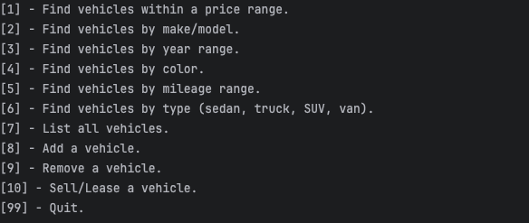
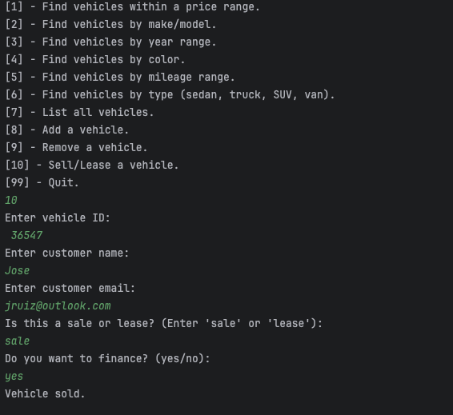
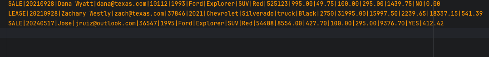

# DealerShip2.0

# My Project overview

============================

For this project we worked together to improve our vehicle dealership application and added 3 new classes that gives the user 3 new options that goes from a contract and based on contract they are looking for it gives the user the option to make a sales contract or a lease contract. Depending on what the customer is looking for it also let's the user know what car is inventory and what car has gotten leased or sold.

Once the user starts the application is shows them the options they have in the application, it gives them up to 10 choices, they can search for any year, make and model, depeding on there search. Once they know what they looking for they can go to option 10 where it allows to start the process of taking out a car.

In the screenshot above once the user chooses option 10 it gives the user the following prompts, where it asks the user for the vehicle id based on the car they want to purchase, once the user inputs the vehicle Id. It's going to ask the customer for their name including email to be able to reach and send their paperwork. Once they input that information it asks the customer what type of finance they are looking for whether it's to lease or to buy the vehicle in full. Once the transaction is done it will prompt the user the car is sold

Once the customer buys the vehicle of there choice the contract file logs that information in and shows what type of purchase the customer did whether it was a lease or a full purhcase including the detailed information provided.

## References

https://www.geeksforgeeks.org/program-emi-calculator/

This link helped us figure out the math for monthly payment and total price.
